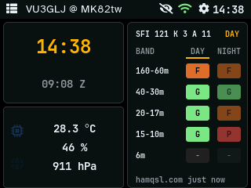
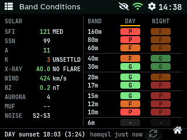
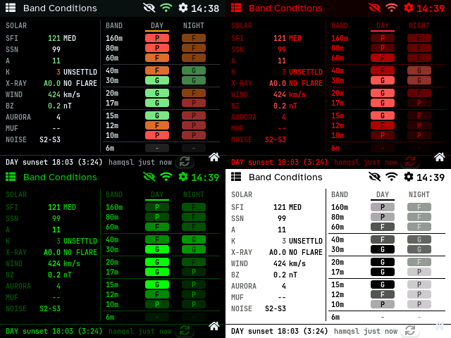

# Screens, Widgets and Themes

How the on-device user interface is put together, and the rules for adding a screen, a dashboard
tile or a theme. It is written for contributors; the code is in `src/ui/`. LVGL 9 draws everything,
on a 320 x 240 landscape display with touch.

The band-conditions screen and the dashboard band tile (v0.2.4) follow every rule here; use them as
worked examples (`src/ui/screens/band_cond.cpp`, `src/ui/widgets/widget_band.cpp`).

 

## Screen geometry

All sizes come from `src/ui/layout.h`; don't write 320, 240 or 216 in a page.

```
 0                                                         319
 ┌───────────────────────────────────────────────────────────┐ 0
 │ ☰  Title                              ⊘  wifi  ⚙  HH:MM   │ status bar
 ├───────────────────────────────────────────────────────────┤ 24
 │                                                           │
 │             page content: view_container                  │
 │             SCREEN_W x CONTENT_H = 320 x 216              │
 │                                                           │
 │                                              keep clear   │
 │                                            ┌───────────┐  │
 │                                            │        ⌂  │  │
 └────────────────────────────────────────────┴───────────┴──┘ 239
                                    home button, ~40 x 24 px
```

- **Status bar** (`status_bar.cpp`): menu button, page title, sleep, WiFi, settings and clock. Pages
  set the title through `ui_navigate_local()`; they never draw in the bar.
- **Content area**: a page gets `view_container` (320 x 216, below the bar) as its parent. Page
  coordinates start at the top-left of this area.
- **Home button** (`home_button.cpp`): a global button pinned 8 px from the bottom-right corner on
  every page except the dashboard. Leave the bottom-right ~40 x 24 px empty; put page buttons left of
  it (the xOTA and band-conditions refresh buttons sit 40 px or more from the right edge).
- **Sidebar** (`sidebar.cpp`): the menu slides over the content; pages don't need to know about it.
- **Full-screen pages** (APRS radar, APRS messages) hide the status bar and the home button and get
  320 x 240; they must offer their own way back.

## The shell and navigation

`ui.cpp` owns the persistent parts (status bar, sidebar, home button, `view_container`) and swaps the
page content:

```
ui_navigate_local(PAGE_X)
  └─ lv_obj_clean(view_container)   deletes the old page
  └─ status_bar_set_title("...")
  └─ draw_x_page(view_container)    the new page builds itself
```

- Pages are listed in `enum LocalPage` (`ui.h`) and drawn in the `if/else` chain of
  `ui_navigate_local()`.
- The sidebar lists menu entries (`sidebar.cpp`, `enum DestScreen`) and maps them to pages in
  `sidebar_selection_cb()`.
- Settings is the exception: it is a separate LVGL screen (`settings_create()/settings_destroy()`),
  not a page in `view_container`.

## Pages

A page is one function, `void draw_x_page(lv_obj_t* parent)`, in `src/ui/screens/x.cpp` with a
header `x.h`. It creates all its objects as children of `parent`.

**Lifecycle.** The page lives until the next `ui_navigate_local()` cleans the container. Anything the
page keeps outside LVGL's object tree must be released when its root object is deleted:

```cpp
s.timer = lv_timer_create(
    [](lv_timer_t*) { refresh(false); }, 2000, nullptr);
lv_obj_add_event_cb(s.root, [](lv_event_t*) {
    if (s.timer) lv_timer_delete(s.timer);  // not a child object
    s = Screen{};  // drop pointers to deleted objects
}, LV_EVENT_DELETE, nullptr);
```

Keep a page's state in one `static` struct (`Screen s;`), reset at the start of `draw_x_page()` and on
delete. A stale pointer to a deleted label is the classic crash.

**Data.** Data comes from a manager in `src/services/`, never from the network directly:

- The UI runs only on the main loop (LVGL isn't thread-safe). Never call `lv_*` from a FreeRTOS task
  or a network callback.
- Background tasks hand results to the main loop; the manager publishes them, and the page polls with
  an LVGL timer (1-5 s). The band screen compares `PropagationManager::get_view().version` with the
  version it last drew, so several screens can follow the same data without clearing each other's
  "dirty" flag (older managers use `is_dirty()/clear_dirty()`).
- Redraw only what changed: update label texts and colours; don't rebuild the page on every tick.

**Text and fonts.** Use the fonts in `fonts.h`; their glyphs are ASCII only (0x20-0x7E). The
fallback is an icons-only font (`font_symbols_10/14`, from Font Awesome 5) holding exactly the
`LV_SYMBOL_*` icons in use plus the degree sign and the bullet. A new `LV_SYMBOL_` (in our code or a
newly enabled LVGL widget) needs its code point added to `scripts/build_fonts.sh` and the fonts
regenerated, or it renders as nothing. Don't use other Unicode characters (☀, ⚠, ·): use words
("DAY", "GREYLINE") or an `LV_SYMBOL_`.

| Font | Use |
|------|-----|
| `font_jetbrains_10` | dense tables and status lines (monospace: columns line up) |
| `font_jetbrains_14` | larger table text (the tile with 3 groups or fewer) |
| `font_jetbrains_24` | big numbers (clock) |
| `font_atkinson_10/14/18` | prose, buttons, titles (`font_atkinson_14` is LVGL's default) |

At 10 px a JetBrains Mono character is about 6 px wide: a 320 px line holds about 50 characters.
Count before adding text to a crowded row; the band screen's footer keeps each half under 25.

**Touch.** Make tap targets at least ~28 x 16 px. Badges, labels and decorations inside a tappable
tile must not swallow the tap: `lv_obj_set_clickable(obj, false)` and
`lv_obj_set_event_bubble(obj, true)` (see `band_badge_create()`).

## Dashboard and tiles

The dashboard (`screens/dashboard.cpp`) places tiles from `src/ui/widgets/`. A tile is
`lv_obj_t* widget_x_create(lv_obj_t* parent, WidgetSize size)`:

```
 ┌────────────────┬────────────────┐
 │ clock          │ band           │  QUARTER    160 x 108 (154 x 104)
 │ QUARTER        │ HALF_VERT      │  HALF_VERT  160 x 216 (154 x 212)
 ├────────────────┤                │  FULL       320 x 216
 │ sensor/weather │                │
 │ QUARTER        │                │  4 px gaps around and between
 └────────────────┴────────────────┘
```

`WidgetSize` values are `WIDGET_SIZE_QUARTER`, `WIDGET_SIZE_HALF_VERT` and `WIDGET_SIZE_FULL`; the
sizes in brackets are what the tiles draw inside the gaps.

Tile rules:

- Panel style: `COLOR_BG_PANEL` background, 1 px `COLOR_BORDER`, radius 6.
- Tapping a tile opens its page (`ui_navigate_local(PAGE_X)`); everything inside bubbles the tap.
- A tile owns a refresh timer and deletes it on `LV_EVENT_DELETE`, like a page.
- If the user can choose what a tile shows, keep the choice in `config::Config` (for example
  `band_groups`), offer it in the web console, and let the tile spread the chosen rows over its
  height (the band tile uses taller rows and the 14 px font for three groups or fewer).

## Themes

Every colour comes from the theme: `theme_color(TOKEN)` (`theme.h`). Never write `lv_color_hex()`
in a page or tile.



There are two kinds of tokens:

- **Palette tokens** (`COLOR_BG_APP` ... `COLOR_BAND_DOWN`): each theme defines all of them in the
  `switch` in `theme.cpp`.
- **Semantic tokens** (`COLOR_TEXT_ON_ACCENT`, `COLOR_STATUS_OK`, `COLOR_BG_BUTTON`, ...): the
  `SEMANTIC[]` table gives Classic's exact colour and, for every other theme, the palette token to
  reuse. Add a semantic token when a new kind of element needs a colour none of the existing ones
  describes, not for a single widget.

| Use | Token |
|-----|-------|
| page background, tile background, borders | `COLOR_BG_APP`, `COLOR_BG_PANEL`, `COLOR_BORDER` |
| text, secondary text | `COLOR_TEXT_MAIN`, `COLOR_TEXT_MUTED` |
| highlight (current column, selected tab) | `COLOR_ACCENT_PRIMARY` |
| good / fair / poor (ratings, value quality) | `COLOR_BAND_GOOD`, `COLOR_BAND_FAIR`, `COLOR_BAND_POOR` |
| text on a coloured badge or button | `COLOR_TEXT_ON_ACCENT` (or the more readable of it and `COLOR_TEXT_MAIN`, see below) |
| neutral button, "no data" badge | `COLOR_BG_BUTTON` |
| status dots | `COLOR_STATUS_OK/ERROR/WARN/BUSY` |

Rules that keep all seven themes readable:

- **Contrast.** One text colour can't suit every badge in every theme (E-Ink Light's "poor" badge is
  light grey). `band_badge.cpp` picks whichever of `COLOR_TEXT_ON_ACCENT` and `COLOR_TEXT_MAIN` has
  the larger luminance difference from the badge.
- **Emphasis without new colours.** To de-emphasise, lower the opacity (`lv_obj_set_style_opa`, 60 %
  stays readable in the dark single-colour themes); to emphasise, underline with
  `COLOR_ACCENT_PRIMARY`.
- **Classic stays identical.** Classic is the reference look; a refactor must not change it (compare
  screenshots, see below).
- **Check every theme.** Capture the page in all seven themes before committing (below).

**Adding a theme:** add it to `enum ThemeId` before `THEME_COUNT`; raise `config::THEME_ID_MAX`
(a `static_assert` in `theme.cpp` reminds you); give it a `case` with every palette token in
`theme_color()` and a name in `theme_get_name()`; add the `<option>` to the theme list in
`data/www/index.html`; add it to `THEMES` in `tools/device_screens.py`; capture all pages.

## Privacy

Screens are photographed and shared. Never show a secret (admin password, WiFi password, API keys,
APRS passcode) in clear: show `******` and reveal it only on a tap, hiding it again after a few
seconds. Treat the WiFi name, IP and MAC address the same way on screens that are likely to be
shared. (The Network screen gets this in v0.2.4.)

## Screenshots

`tools/device_screens.py` captures pages over WiFi from a `cyd-screens` build (debug only, never
released). Its `PAGES` list must match `enum LocalPage` in order.

**Capture only new or changed screens**, in the themes the change affects (all seven when colours or
layout changed), and replace just those images in `docs/pics/` and the README. A full capture of
every screen is needed only when something shared changes (the shell, fonts, a theme's palette).

```bash
pio run -e cyd-screens -t upload
QRP_ADMIN_PW=... python3 -I tools/device_screens.py \
    --ip <device-ip> --out release/shots/now \
    --themes 0,1,2,3,4,5,6 --pages 0,9 \
    [--compare release/shots/before]
```

The `cyd-screens` build has less free heap than a release build: HTTPS requests with certificate
checks (Cloud OTA) can fail on it. Judge network behaviour on the `cyd` build.

## Checklists

**New page**
1. `src/ui/screens/x.{h,cpp}` with `draw_x_page(parent)`; state in one static struct; timers deleted
   on `LV_EVENT_DELETE`.
2. Add `PAGE_X` to `enum LocalPage` (at the end: the screenshot tool uses the numbers) and a branch
   with a title in `ui_navigate_local()`.
3. If it belongs in the menu: `DEST_X` in `sidebar.h`, an entry in `sidebar.cpp`, a case in
   `sidebar_selection_cb()`.
4. Data through a manager; no `lv_*` outside the main loop.
5. Keep the bottom-right corner free for the home button.
6. Add it to `PAGES` in `tools/device_screens.py`; capture it in all themes; add the screenshot to
   the README table. Later changes to the page: recapture only this page.

**New tile**
1. `src/ui/widgets/widget_x.{h,cpp}` with `widget_x_create(parent, size)`, panel style as above.
2. Place it in `draw_dashboard_page()`; tap opens its page.
3. Timer and pointers released on `LV_EVENT_DELETE`.
4. A user choice of content goes in `config::Config` + the web console (see `config_json.cpp`).

**New colour need**
1. Use an existing token if one describes the element.
2. Otherwise add a semantic token (Classic value + the palette token other themes reuse).
3. Capture all seven themes.
